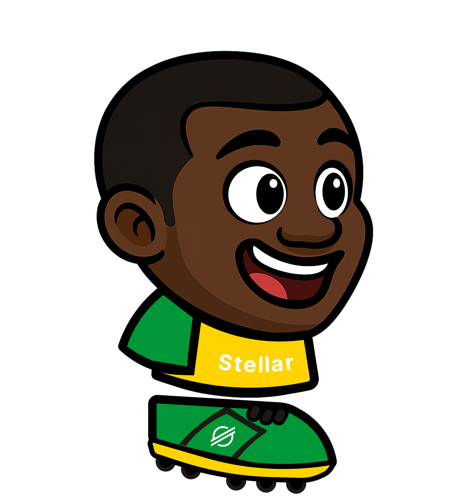

# 🌟 Stellar Heads


A physics-based 2D soccer game built with Rust and Bevy, featuring blockchain integration with Stellar for competitive leaderboards.

## Game Overview

Play as a soccer player against an AI opponent in fast-paced matches. Score goals using realistic physics, compete on global leaderboards stored on the Stellar blockchain, and track your progress with detailed statistics.

## Features

- **Physics-Based Soccer**: Realistic ball physics with momentum and collision dynamics
- **AI Opponent**: Smart AI that chases the ball and defends goals
- **Multiple Characters**: 4 unique player designs randomly selected each match
- **Blockchain Leaderboard**: Stellar smart contracts store competitive rankings
- **Web Integration**: Play in browser with WASM or run natively

## Game Assets

### Main Game Screen


### Player Characters
   

### Game Ball


## Controls

- **A/D or Arrow Keys**: Move left/right
- **Space**: Jump
- **X**: Kick ball when in range

## Tech Stack

- **Game Engine**: Rust + Bevy with Avian2D physics
- **Frontend**: Yew framework with WebAssembly
- **Backend**: Axum web server with PostgreSQL
- **Blockchain**: Stellar network with Soroban smart contracts

## Getting Started

```bash
# Clone and build
git clone <repo-url>
cd stellar_heads
cargo build

# Run the game
cargo run
```